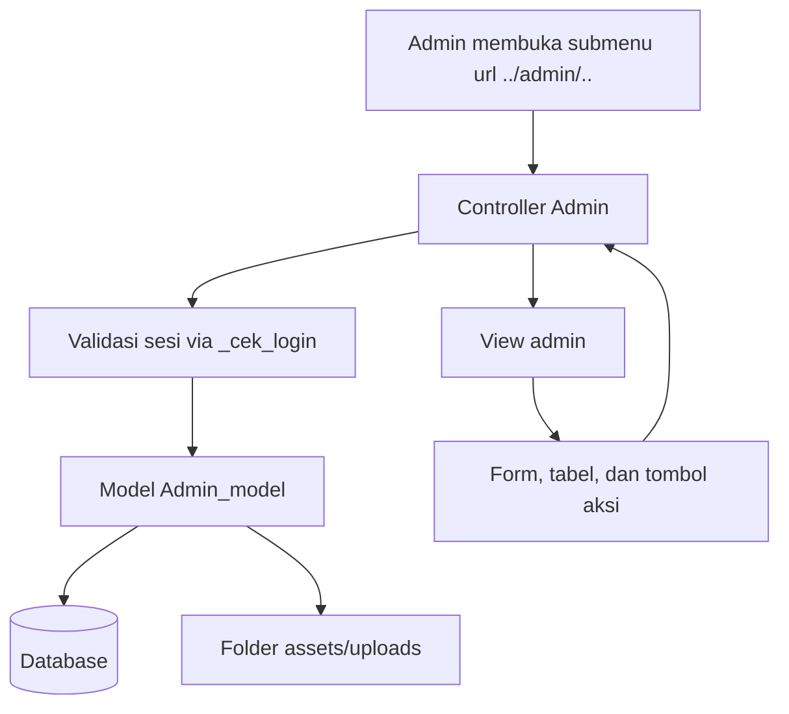
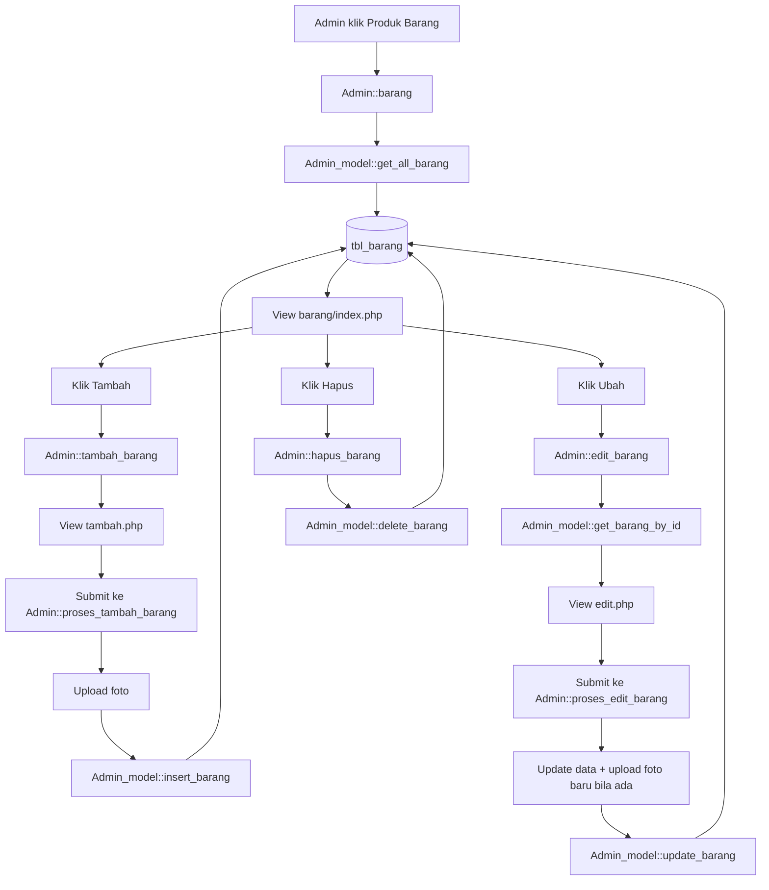
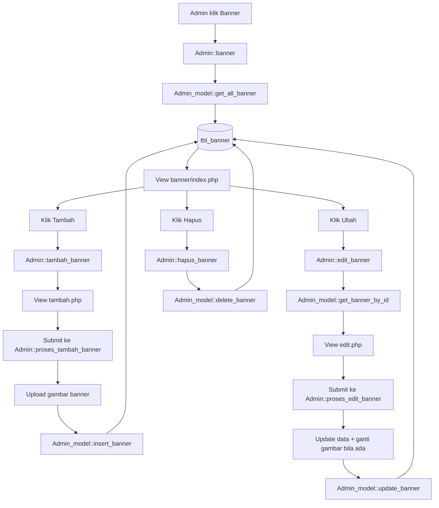
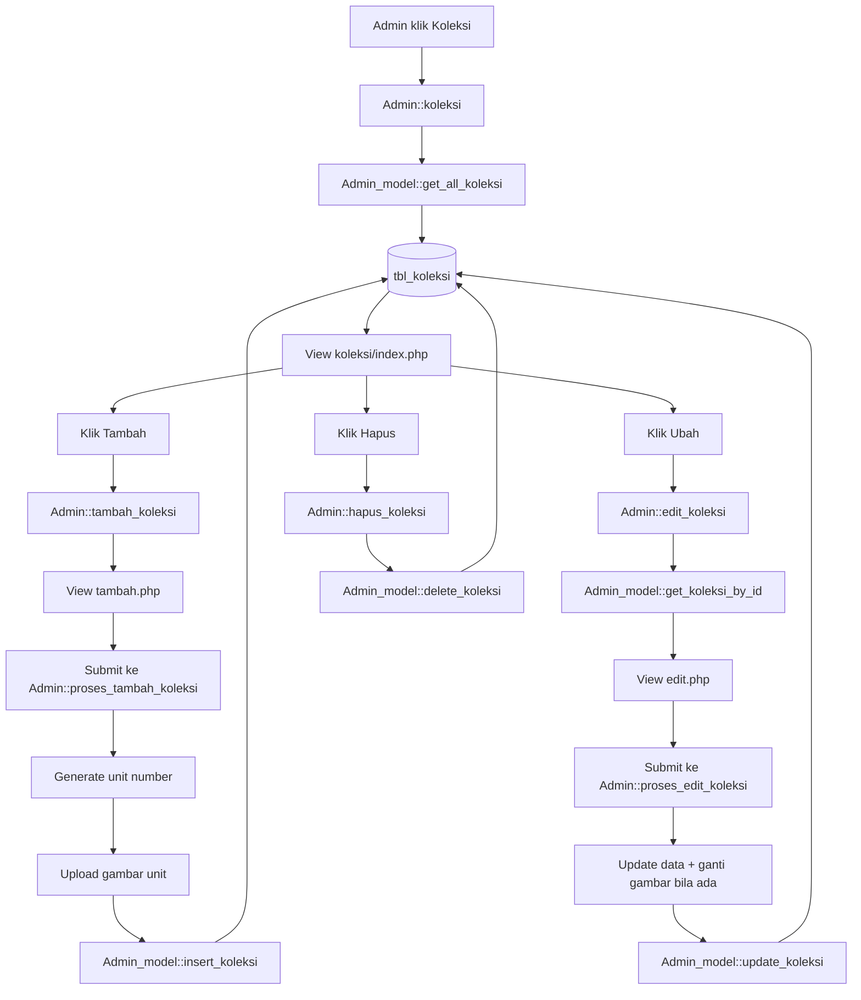
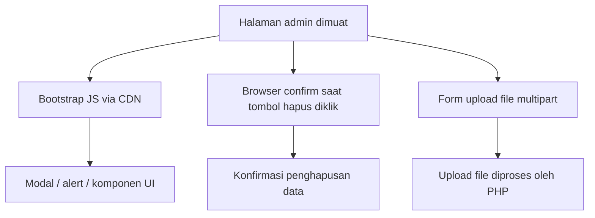

# Dokumentasi Alur Menu Admin

Dokumen ini memaparkan alur kerja sistem pada menu admin untuk tiga modul utama, yaitu Produk Barang, Banner, dan Koleksi. Dokumentasi ini disusun secara terstruktur untuk memperjelas hubungan antara file PHP, file JavaScript/asset, serta fungsi-fungsi yang terlibat dalam proses CRUD.

## Tujuan Dokumen

Dokumen ini bertujuan untuk membantu pembaca memahami:
- alur proses bisnis pada setiap menu admin,
- komponen teknis yang terlibat,
- serta hubungan antar file yang digunakan untuk menjalankan fitur tersebut.

---

## 1. Gambaran Umum Arsitektur

Secara umum, seluruh submenu admin pada aplikasi ini mengikuti pola arsitektur MVC CodeIgniter.

### Komponen inti
- Controller: [application/controllers/Admin.php](../application/controllers/Admin.php)
- Model: [application/models/Admin_model.php](../application/models/Admin_model.php)
- Template admin: [application/views/admin/template](../application/views/admin/template)
- View submenu: [application/views/admin](../application/views/admin)

---

## 2. Alur Proses PHP per Menu

### 2.1 Produk Barang

Submenu Produk Barang digunakan untuk mengelola daftar produk yang ditampilkan pada sistem. Alur prosesnya mencakup tampilan daftar, penambahan data, pembaruan data, hingga penghapusan data.

### File PHP terkait
- [application/controllers/Admin.php](../application/controllers/Admin.php)
- [application/models/Admin_model.php](../application/models/Admin_model.php)
- [application/views/admin/barang/index.php](../application/views/admin/barang/index.php)
- [application/views/admin/barang/tambah.php](../application/views/admin/barang/tambah.php)
- [application/views/admin/barang/edit.php](../application/views/admin/barang/edit.php)

### Tujuan proses
- Menampilkan daftar produk
- Menambahkan produk baru
- Memperbarui data produk
- Menghapus data produk secara soft delete

---

### 2.2 Banner

Submenu Banner digunakan untuk mengelola konten promosi visual yang ditampilkan pada halaman utama. Alur prosesnya meliputi penginputan judul, deskripsi, status, dan gambar banner.

### File PHP terkait
- [application/controllers/Admin.php](../application/controllers/Admin.php)
- [application/models/Admin_model.php](../application/models/Admin_model.php)
- [application/views/admin/banner/index.php](../application/views/admin/banner/index.php)
- [application/views/admin/banner/tambah.php](../application/views/admin/banner/tambah.php)
- [application/views/admin/banner/edit.php](../application/views/admin/banner/edit.php)

### Tujuan proses
- Menampilkan daftar banner
- Menambahkan banner baru
- Memperbarui isi banner
- Menghapus banner secara soft delete

---

### 2.3 Koleksi

Submenu Koleksi digunakan untuk mengelola item-item yang dikelompokkan berdasarkan kategori. Modul ini memiliki fitur tambahan berupa pembuatan nomor unit otomatis untuk setiap data koleksi baru.

### File PHP terkait
- [application/controllers/Admin.php](../application/controllers/Admin.php)
- [application/models/Admin_model.php](../application/models/Admin_model.php)
- [application/views/admin/koleksi/index.php](../application/views/admin/koleksi/index.php)
- [application/views/admin/koleksi/tambah.php](../application/views/admin/koleksi/tambah.php)
- [application/views/admin/koleksi/edit.php](../application/views/admin/koleksi/edit.php)

### Tujuan proses
- Menampilkan daftar koleksi
- Membuat nomor unit secara otomatis
- Menambahkan koleksi baru
- Memperbarui data koleksi
- Menghapus koleksi secara soft delete

---

## 3. Alur JavaScript dan Asset yang Terlibat

Secara umum, tidak terdapat file JavaScript kustom yang khusus dibuat untuk modul admin ini. Interaksi pengguna pada sisi klien lebih banyak didukung oleh elemen HTML, Bootstrap, serta fungsi bawaan browser seperti confirm().

### File terkait
- [application/views/admin/template/footer.php](../application/views/admin/template/footer.php)
- [application/views/admin/barang/index.php](../application/views/admin/barang/index.php)
- [application/views/admin/banner/index.php](../application/views/admin/banner/index.php)
- [application/views/admin/koleksi/index.php](../application/views/admin/koleksi/index.php)

### Peran JS dan asset
- Bootstrap JS digunakan untuk mendukung tampilan antarmuka yang lebih konsisten
- `confirm()` digunakan untuk meminta konfirmasi sebelum menghapus data
- Form upload file digunakan untuk mengunggah gambar produk, banner, maupun koleksi

---

## 4. Fungsi-Fungsi yang Terlibat Secara Terpisah

### 4.1 Fungsi di Controller
Pada [application/controllers/Admin.php](../application/controllers/Admin.php), fungsi yang berperan adalah:

- `__construct()`
- `_cek_login()`
- `_generate_guid_filename()`
- `barang()`
- `tambah_barang()`
- `proses_tambah_barang()`
- `edit_barang()`
- `proses_edit_barang()`
- `hapus_barang()`
- `banner()`
- `tambah_banner()`
- `proses_tambah_banner()`
- `edit_banner()`
- `proses_edit_banner()`
- `hapus_banner()`
- `koleksi()`
- `tambah_koleksi()`
- `proses_tambah_koleksi()`
- `edit_koleksi()`
- `proses_edit_koleksi()`
- `hapus_koleksi()`

### 4.2 Fungsi di Model
Pada [application/models/Admin_model.php](../application/models/Admin_model.php), fungsi yang berperan adalah:

- `get_all_barang()`
- `insert_barang()`
- `get_barang_by_id()`
- `update_barang()`
- `delete_barang()`
- `get_all_banner()`
- `insert_banner()`
- `get_banner_by_id()`
- `update_banner()`
- `delete_banner()`
- `get_all_koleksi()`
- `get_koleksi_by_id()`
- `get_koleksi_by_category()`
- `insert_koleksi()`
- `update_koleksi()`
- `delete_koleksi()`
- `generate_koleksi_unit_number()`
- `format_koleksi_unit_number()`

### 4.3 Fungsi pendukung lain
- `site_url()` dan `base_url()` digunakan pada view untuk mengarahkan form serta tombol aksi
- `redirect()` digunakan oleh controller untuk mengalihkan pengguna ke halaman daftar setelah proses CRUD selesai
- `session->set_flashdata()` digunakan untuk menampilkan pesan sukses atau error kepada admin

---

## 5. Peta Singkat Menu Admin

| Menu | Controller | Model | View utama | Tujuan utama |
| --- | --- | --- | --- | --- |
| Produk Barang | [application/controllers/Admin.php](../application/controllers/Admin.php) | [application/models/Admin_model.php](../application/models/Admin_model.php) | [application/views/admin/barang/index.php](../application/views/admin/barang/index.php) | CRUD produk |
| Banner | [application/controllers/Admin.php](../application/controllers/Admin.php) | [application/models/Admin_model.php](../application/models/Admin_model.php) | [application/views/admin/banner/index.php](../application/views/admin/banner/index.php) | CRUD banner |
| Koleksi | [application/controllers/Admin.php](../application/controllers/Admin.php) | [application/models/Admin_model.php](../application/models/Admin_model.php) | [application/views/admin/koleksi/index.php](../application/views/admin/koleksi/index.php) | CRUD koleksi |

---

## 6. Kesimpulan

Secara keseluruhan, alur menu admin dapat dipahami sebagai rangkaian proses yang konsisten:
1. Admin membuka submenu dari sidebar.
2. Controller menerima permintaan dan memanggil fungsi yang sesuai pada model.
3. Model berinteraksi dengan database dan/atau folder upload.
4. View menampilkan hasil proses, baik dalam bentuk daftar data maupun form input.

Dokumen ini disusun dengan pendekatan yang lebih formal dan profesional agar memudahkan pembaca memahami arsitektur dan alur kerja modul admin secara menyeluruh.
